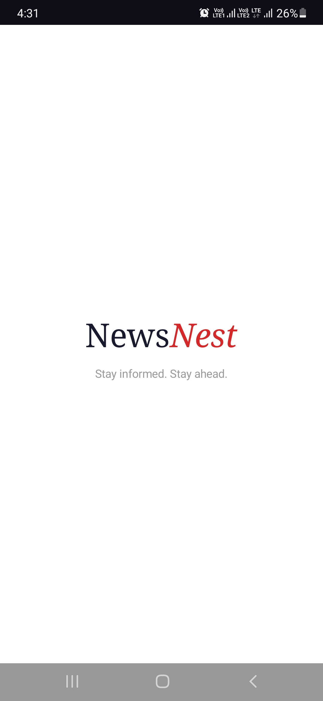
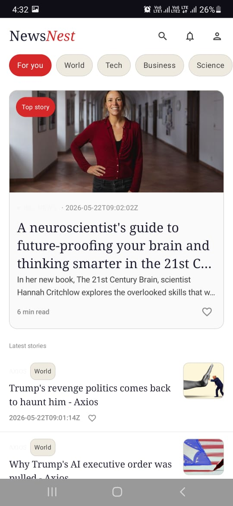
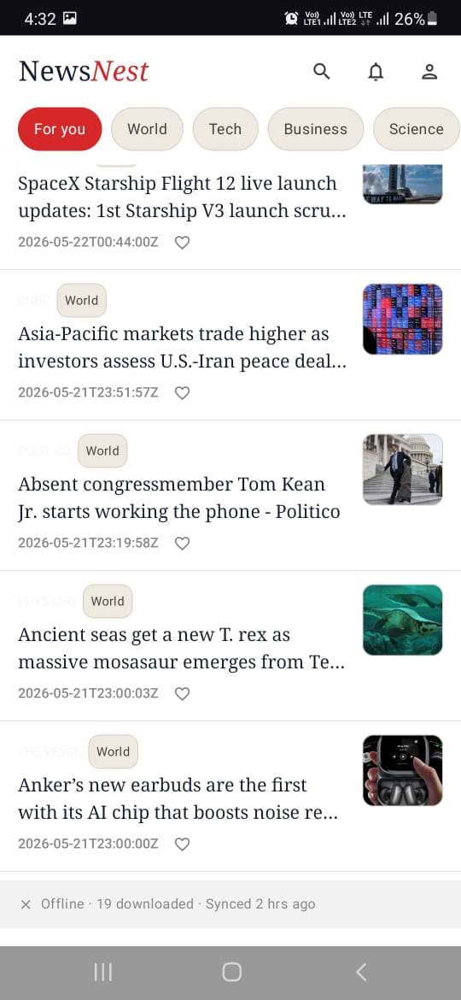
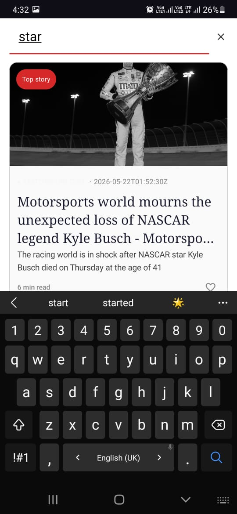
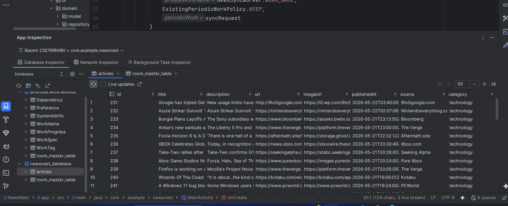
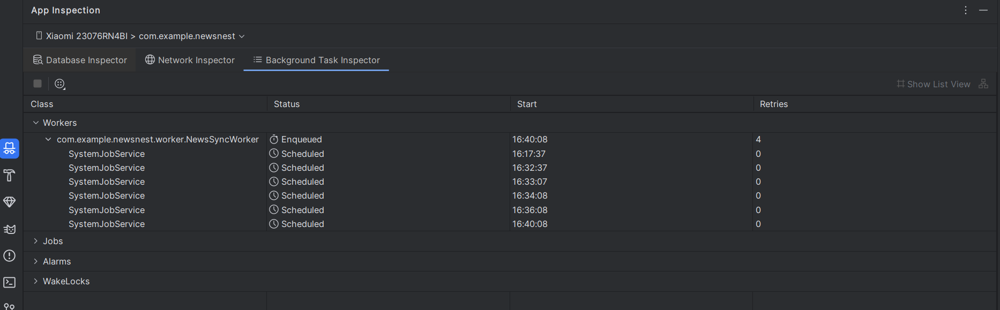

# NewsNest 🪺

> *Stay informed. Stay ahead.*

A modern Android news aggregator built with Clean Architecture, offline-first design, and a refined editorial UI — delivering categorized, searchable headlines with zero flicker and seamless background sync.

---


## Problem Statement

News consumption on mobile is broken in three ways:

1. **Connectivity dependence** — most news apps show a blank screen or error when offline, leaving users stranded.
2. **Category noise** — headlines from unrelated domains are mixed together with no meaningful filtering.
3. **Stale data** — apps either hammer the network on every open (slow) or never refresh in the background (outdated).

NewsNest solves all three: it caches everything locally, filters by category, and syncs silently in the background so the user always opens to fresh, readable content — even without a connection.

---

## Motive

The goal was not just to build *a* news app — it was to build one that demonstrates production-grade Android engineering:

- A clean separation between what the app *knows* (domain), what it *fetches* (data), and what it *shows* (UI)
- A single source of truth — the UI never reads from the network directly
- Background refresh that respects battery and network constraints
- A search experience that feels instant because it filters cached data, not a live API

This project serves as a reference implementation of modern Android architecture for a real-world use case.

---

## 📺 Demo

[](https://youtu.be/usWWrsMuUTg)

> Click the thumbnail to watch the full demo on YouTube.

---

## 📸 Screenshots

### App Screens

| Splash | Home | Offline Strip | Search |
|--------|------|---------------|--------|
|  |  |  |  |

### Under the Hood

| Room Database Inspector | WorkManager Background Task Inspector |
|-------------------------|---------------------------------------|
|  |  |

> **Room DB** — articles table live with `id`, `title`, `description`, `url`, `imageUrl`, `publishedAt`, `source`, `category` columns populated per category.
>
> **WorkManager** — `NewsSyncWorker` enqueued and `SystemJobService` scheduled across multiple time slots, confirming periodic background sync is live on device.

---


## Core Architecture — Clean Architecture + MVVM

```
┌─────────────────────────────────────────────────────┐
│                    UI Layer                         │
│         (Jetpack Compose + ViewModel)               │
│   ArticleListScreen  ─►  ArticleListViewModel       │
│   SplashScreen       ─►  NavGraph                   │
└────────────────────┬────────────────────────────────┘
                     │ StateFlow / collectAsStateWithLifecycle
┌────────────────────▼────────────────────────────────┐
│                  Domain Layer                       │
│            (Pure Kotlin — no Android)               │
│   GetArticlesUseCase   RefreshArticlesUseCase       │
│   Article (model)      ArticleRepository (interface)│
└────────────────────┬────────────────────────────────┘
                     │ implements
┌────────────────────▼────────────────────────────────┐
│                  Data Layer                         │
│         (Room + Retrofit + Repository)              │
│   ArticleRepositoryImpl                             │
│   ArticleDao (Room)    NewsApiService (Retrofit)    │
│   ArticleEntity        ArticleDto                   │
└─────────────────────────────────────────────────────┘
```

### Why Clean Architecture?

Each layer only knows about the layer directly below it. The UI never touches Retrofit. The domain never touches Room. This means:

- The API can be swapped without touching the UI
- The database schema can change without touching business logic
- Use cases can be unit tested with zero Android dependencies

---

## Core Heart Algorithm — Offline-First with Single Source of Truth

The central design decision of NewsNest is that **Room is the only source of truth**. The UI never reads directly from the network.

```
User opens app
      │
      ▼
Room emits cached articles instantly  ──►  UI renders immediately (no blank screen)
      │
      ▼
WorkManager / ViewModel triggers refreshArticles(category)
      │
      ▼
Retrofit fetches from NewsAPI
      │
      ▼
deleteByCategory(category)  ──►  insertAll(newEntities)
      │
      ▼
Room Flow emits updated list  ──►  UI updates automatically
```

Key insight: `dao.getByCategory()` returns a `Flow<List<ArticleEntity>>`. Room observes its own table — the moment new rows are inserted, the Flow emits and the UI recomposes. No manual UI refresh. No polling. Pure reactive data propagation.

### Search Algorithm

Search is entirely client-side with debouncing — no extra API calls:

```
User types query
      │
      ▼
_searchQuery (MutableStateFlow) emits
      │
      ▼
debounce(300ms)  ──►  waits for user to stop typing
      │
      ▼
combine(getArticlesUseCase(category), searchQuery)
      │
      ▼
filter {
  title.contains(query, ignoreCase = true) ||
  description?.contains(query, ignoreCase = true) ||
  source.contains(query, ignoreCase = true)
}
      │
      ▼
ArticleUiState.Success(filtered) or ArticleUiState.Empty(query)
```

300ms debounce prevents a filter recomputation on every keystroke — the list only updates when the user pauses.

---

## Design Patterns

| Pattern | Where Used | Why |
|---|---|---|
| **Repository** | `ArticleRepositoryImpl` | Abstracts data sources behind a single interface; ViewModel never knows if data came from Room or Retrofit |
| **Use Case (Interactor)** | `GetArticlesUseCase`, `RefreshArticlesUseCase` | Encapsulates single business operations; keeps ViewModel thin |
| **Observer (Reactive)** | `Flow` throughout all layers | Data changes propagate automatically from Room → ViewModel → UI with no manual callbacks |
| **State Machine** | `ArticleUiState` sealed interface | UI is a pure function of state — `Loading`, `Success`, `Empty`, `Error` are exhaustive and mutually exclusive |
| **Mapper** | `toDomain()`, `toEntity()` | Each layer owns its own model; mappers translate at boundaries so no layer leaks its types into another |
| **Singleton** | `AppDatabase` | One Room instance per process; prevents connection conflicts and wasted memory |
| **Dependency Injection** | Hilt throughout | Decouples construction from usage; enables testability and single-instance management |

---

## WorkManager — Background Sync

WorkManager handles periodic background refresh — the app stays current even when it hasn't been opened.

```kotlin
// Runs every 15 minutes, only on unmetered network
val syncRequest = PeriodicWorkRequestBuilder<NewsSyncWorker>(
    repeatInterval = 15,
    repeatIntervalTimeUnit = TimeUnit.MINUTES
)
.setConstraints(
    Constraints.Builder()
        .setRequiredNetworkType(NetworkType.UNMETERED)  // WiFi only
        .build()
)
.build()

WorkManager.getInstance(context).enqueueUniquePeriodicWork(
    "news_sync",
    ExistingPeriodicWorkPolicy.KEEP,   // don't restart if already scheduled
    syncRequest
)
```

### Why WorkManager over AlarmManager or coroutines?

| | WorkManager | AlarmManager | Coroutine |
|---|---|---|---|
| Survives process death | ✅ | ✅ | ❌ |
| Respects Doze mode | ✅ | ❌ | ❌ |
| Network constraints | ✅ | ❌ | ❌ |
| Guaranteed execution | ✅ | ✅ | ❌ |
| Battery friendly | ✅ | ❌ | ✅ |

WorkManager is the only option that is **guaranteed to run**, **battery-aware**, and **constraint-aware** — exactly what a background news sync needs.

### NewsSyncWorker

```kotlin
class NewsSyncWorker(
    context: Context,
    params: WorkerParameters,
    private val refreshArticlesUseCase: RefreshArticlesUseCase
) : CoroutineWorker(context, params) {

    override suspend fun doWork(): Result {
        return try {
            listOf("general", "technology", "business", "science", "health")
                .forEach { category -> refreshArticlesUseCase(category) }
            Result.success()
        } catch (e: Exception) {
            Result.retry()   // WorkManager will back off and retry automatically
        }
    }
}
```

---

## Tech Stack

| Component | Technology |
|---|---|
| UI | Jetpack Compose + Material 3 |
| Navigation | Navigation Compose |
| State management | StateFlow + collectAsStateWithLifecycle |
| Dependency injection | Hilt |
| Local database | Room |
| Networking | Retrofit + Gson |
| Image loading | Coil |
| Background sync | WorkManager |
| Architecture | Clean Architecture + MVVM |
| Language | Kotlin 100% |

---

## Module Structure

```
NewsNest/
├── app/
│   └── src/main/java/com/example/newsnest/
│       ├── data/
│       │   ├── local/          # Room — ArticleDao, ArticleEntity, AppDatabase
│       │   ├── remote/         # Retrofit — NewsApiService, DTOs
│       │   └── repository/     # ArticleRepositoryImpl, mappers
│       ├── ui/
│       │   ├── list/           # ArticleListScreen, ViewModel, UiState
│       │   ├── detail/         # ArticleDetailScreen
│       │   ├── splash/         # SplashScreen
│       │   ├── components/     # CategoryChipRow, SourceTag, OfflineStrip
│       │   ├── navigation/     # NewsNestNavGraph
│       │   └── theme/          # Colors, Typography, Fonts
│       └── worker/             # NewsSyncWorker
└── domain/
    ├── model/                  # Article (pure Kotlin)
    ├── repository/             # ArticleRepository (interface)
    └── usecase/                # GetArticlesUseCase, RefreshArticlesUseCase
```

---

## Data Flow Summary

```
NewsAPI (Remote)
     │  Retrofit
     ▼
ArticleDto  ──toEntity()──►  ArticleEntity
                                   │  Room INSERT
                                   ▼
                             articles table
                                   │  Room Flow
                                   ▼
                             ArticleEntity  ──toDomain()──►  Article
                                                                │  StateFlow
                                                                ▼
                                                          ArticleUiState
                                                                │  Compose
                                                                ▼
                                                             UI Screen
```

---

*Built with ❤️ by [inquisitivefiza](https://github.com/inquisitivefiza)*
